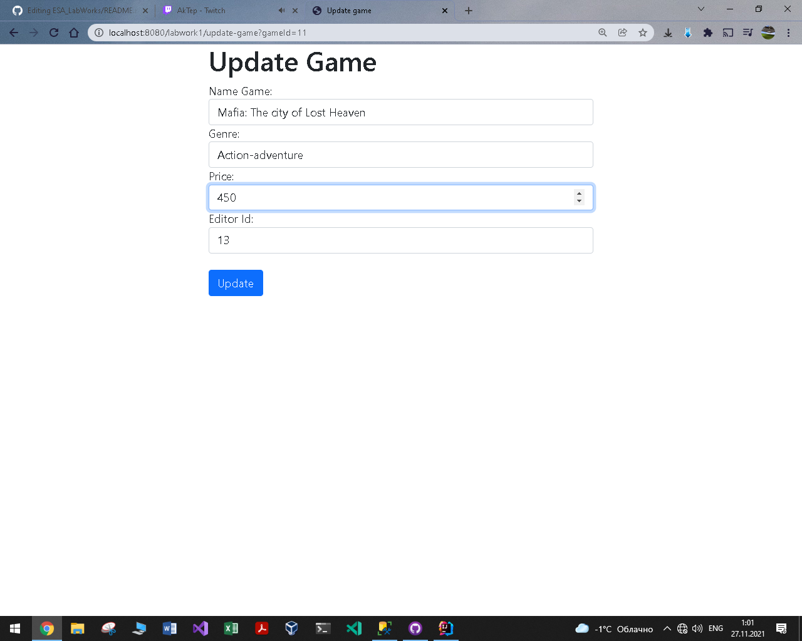

# Лабораторная работа №1 по курсу "Архитектура Корпоративных Систем": "Application with common JavaEE architecture" 
# Средства, используемые для разработки приложения
* JDK 16.0.2
* Jakarta EE 9.1
* GlassFish 6.2.1
* PostgreSQL 13.3
* Intellij IDEA Ultimate 2021.2.1

# Задание на лабораторную работу
<table>
    <thead>
        <tr>
            <th colspan = 7> General Task</th>
        </tr>
        <tr>
            <th colspan = 7> You are to develop an application using common JavaEE architecture and technologies. It should have three layers (data, logic, view) and provide means to work with a database.
It is strongly recommended to use version control and source code management system (like GitHub).
It is strongly recommended to use Maven to manage your project.
You can choose any IDE, but IntelliJ IDEA is recommended.
You may not use IDE to deploy your project to an application server. All deployment should be made using administrative console.
 </th>
        </tr>
        <th>Task 1</th>       
        <th>Task 2</th> 
        <th>Task 3</th>
        <th>Task 4</th>       
        <th>Task 5</th>
        <th>Task 6</th>       
        <th>Task 7</th>
    </thead>
    <tbody>
        <th>Download GlassFish application server.
Install it by unpacking the archive.
Start the application server.
Open an administrative console and go through its controls.
</th>       
        <th>If you have no DBMS installed, please install one. You can choose any SQL DBMS you like, but PostgreSQL and MySQL are preferred.
</th> 
        <th>Choose any subject area and make a model with at least two entities with a few properties.
Create a script to make a database for your model.
</th>
        <th>Develop data layer as Java Beans for the model and make them prepared for use with Entity Persistence.
</th>       
        <th>Implement business layer for accessing data using session beans.
</th>
        <th>Implement view layer using any technology of your choice, which is applicable here.
</th>       
        <th>Make everything work together…
</th>
    </tbody>
</table>

# Модель
В качетсве модели была выбрана модель "Издатель - КомпьютернаяИгра", собствеено учатсники данной модели и являются сущностями. 
Схема базы данных "store", представлена на рисунке ниже. 
  
Для работы с базой данных использовались следующие скрипты: 
<a href="https://github.com/Black-Viking-63/ESA_LabWork/blob/main/labwork1final/sql_scripts/create_data.sql">create_data.sql - создание таблиц.</a> 
<a href="https://github.com/Black-Viking-63/ESA_LabWork/blob/main/labwork1final/sql_scripts/insert_data.sql">insert_data.sql - заполнение таблиц.</a> 
<a href="https://github.com/Black-Viking-63/ESA_LabWork/blob/main/labwork1final/sql_scripts/create_data.sql">delete_data.sql - удаление данных из таблицы.</a>  

# Представление данных
JSP and Bootstrap

# **Editor**
| create_editor | show_editors | update_editor |
| --- | --- | --- |
|  |  |  |

# **Game**
| create_game | show_games | update_game |
| --- | --- | --- |
|  |  |  |
