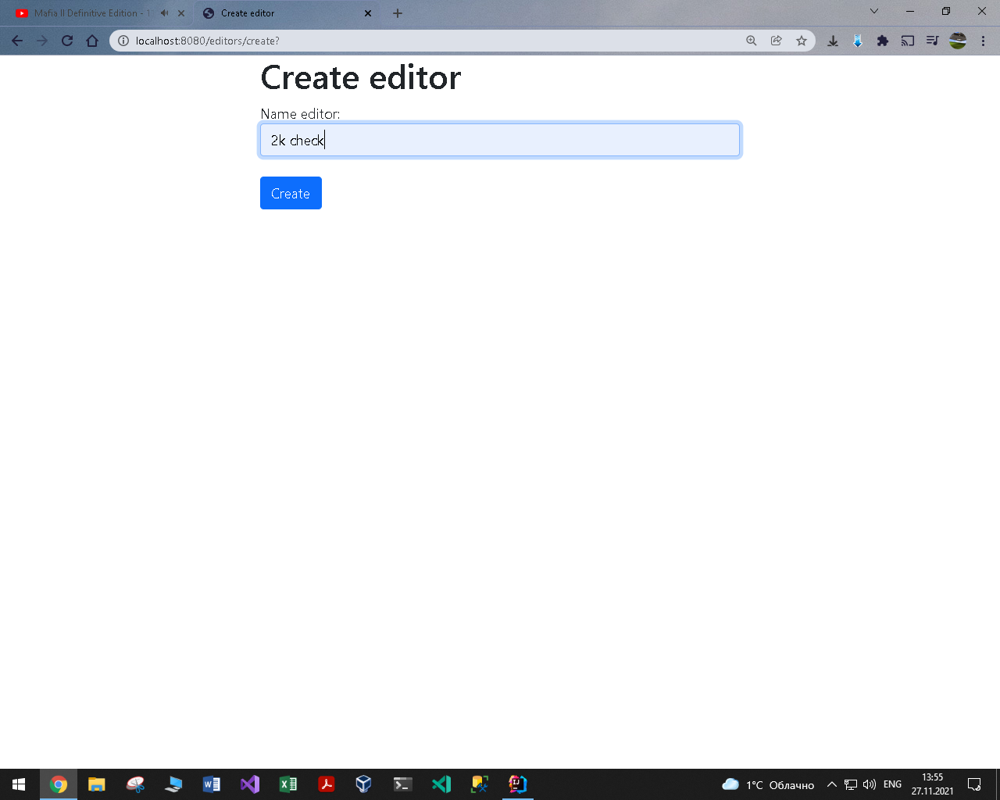
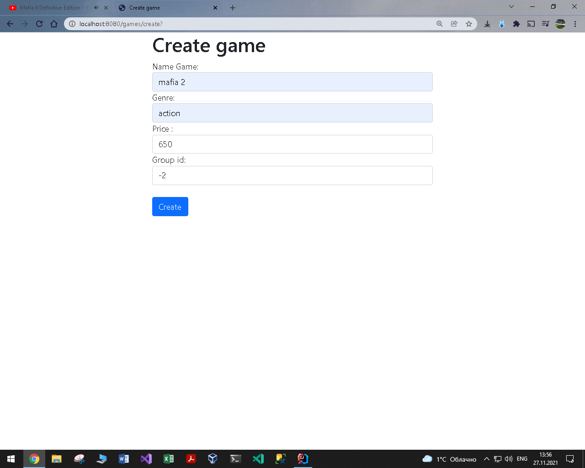

# Лабораторная работа №2 по курсу "Архитектура Корпоративных Систем": "Application using Spring Framework" 

# Отличия от предыдущей лабораторной работы.
Внешне практически никаких. **Однако** была изменена внутренность программы, а точнее то, на чем она была написана: 
Если в *первой работе были сервлеты, ejb и jsp*, то в _этой используется spring framework_.
# Средства, используемые для разработки приложения
* JDK 16.0.2
* Spring Framework 5.3.9
* Tomcat 9.0.52
* PostgreSQL 13.3
* Intellij IDEA Ultimate 2021.2.1

# Задание на лабораторную работу
<table>
    <thead>
        <tr>
            <th colspan = 5> General Task</th>
        </tr>
        <tr>
            <th colspan = 5> You are to develop an application using common Spring architecture and technologies. It should have three layers (data, logic, view) and provide means to work with a database. It is strongly recommended to use version control and source code management system (like GitHub). It is strongly recommended to use Maven to manage your project. You can choose any IDE, but IntelliJ IDEA is recommended.
 </th>
        </tr>
        <th>Task 1</th>       
        <th>Task 2</th> 
        <th>Task 3</th>
        <th>Task 4</th>       
        <th>Task 5</th>    
    </thead>
    <tbody>     
        <th> Choose any subject area and make a model with at least two entities with a few properties. Create a script to make a database for your model. Yes, you can use the same models and scripts you used before.
        </th> 
        <th> Develop data layer as Java Beans for the model and make them prepared for use with Hibernate. Create additional Hibernate classes and configuration files, as required.
        </th>
        <th> Implement business layer using Spring beans.
        </th>       
        <th> Implement view layer using Spring MVC.
        </th>
        <th> Make everything work together…
        </th>
    </tbody>
</table>

# Модель и бизнес-логика
Spring Data JPA, Spring MVC 
В качетсве модели использовалась модель из предыдущей лабораторной работы: "Издатель - КомпьютернаяИгра", собственно учатсники данной модели и являются сущностями. 
Схема базы данных "store", представлена на рисунке ниже. 
  
Для работы с базой данных использовались следующие скрипты: 
<a href="https://github.com/Black-Viking-63/ESA_LabWork/blob/main/labwork2final/sql_script/create_data">create_data.sql - создание таблиц.</a> 
<a href="https://github.com/Black-Viking-63/ESA_LabWork/blob/main/labwork2final/sql_script/insert_data">insert_data.sql - заполнение таблиц.</a> 
<a href="https://github.com/Black-Viking-63/ESA_LabWork/blob/main/labwork2final/sql_script/create_data">delete_data.sql - удаление данных из таблицы.</a>  

# Представление данных
Thymeleaf and Bootstrap

# **Editor**
| create_editor | show_editors | group_games | update_editor |
| --- | --- | --- | --- |
|  |  |  |  |

# **Game**
| create_game | show_games | update_game |
| --- | --- | --- |
|  |  |  |
