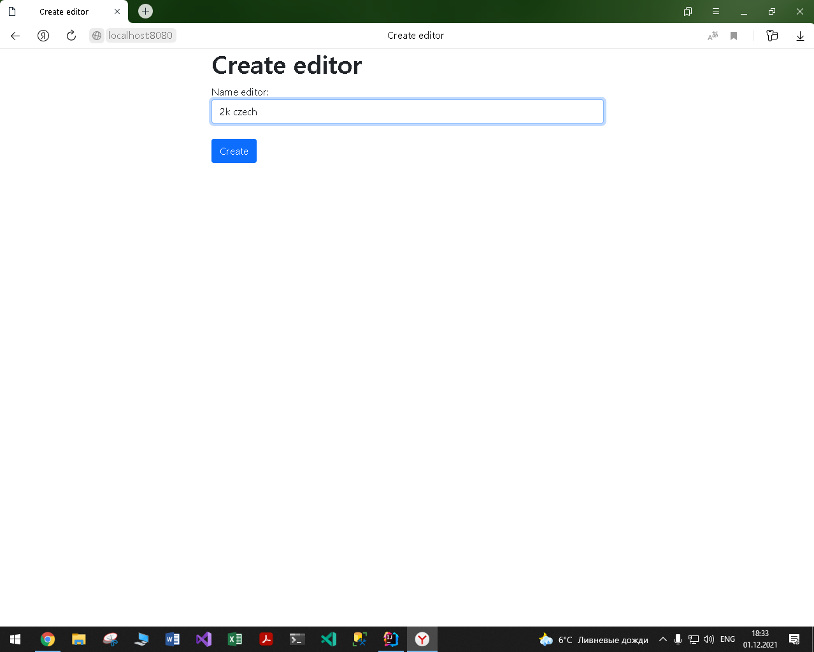
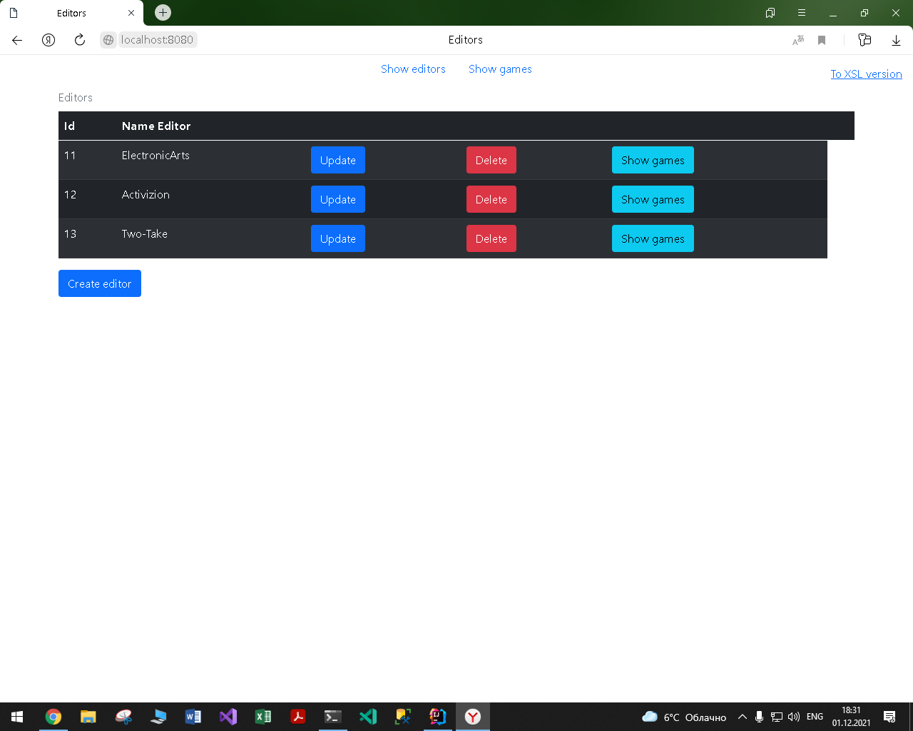
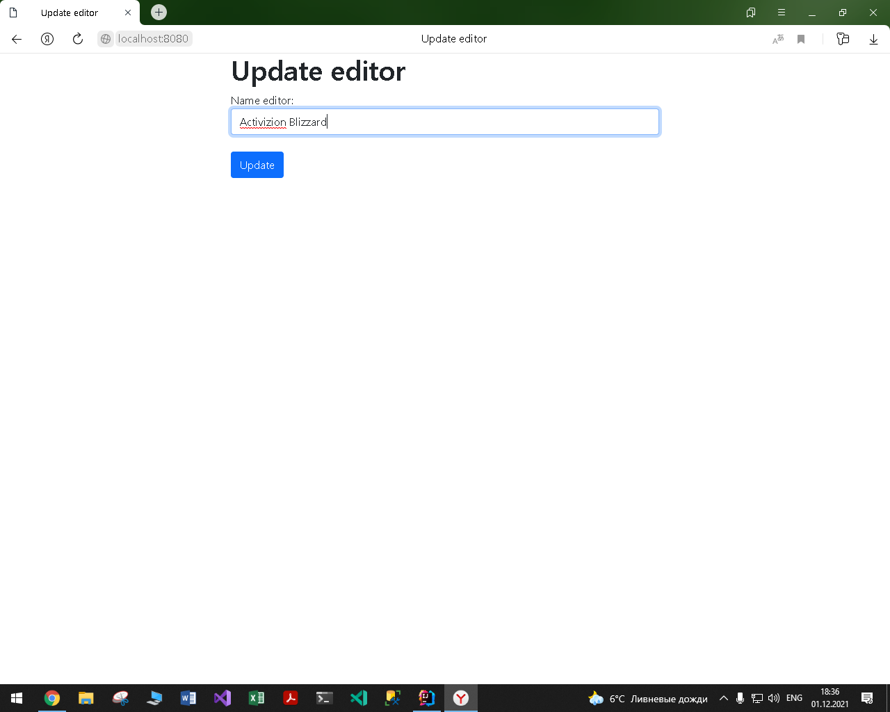
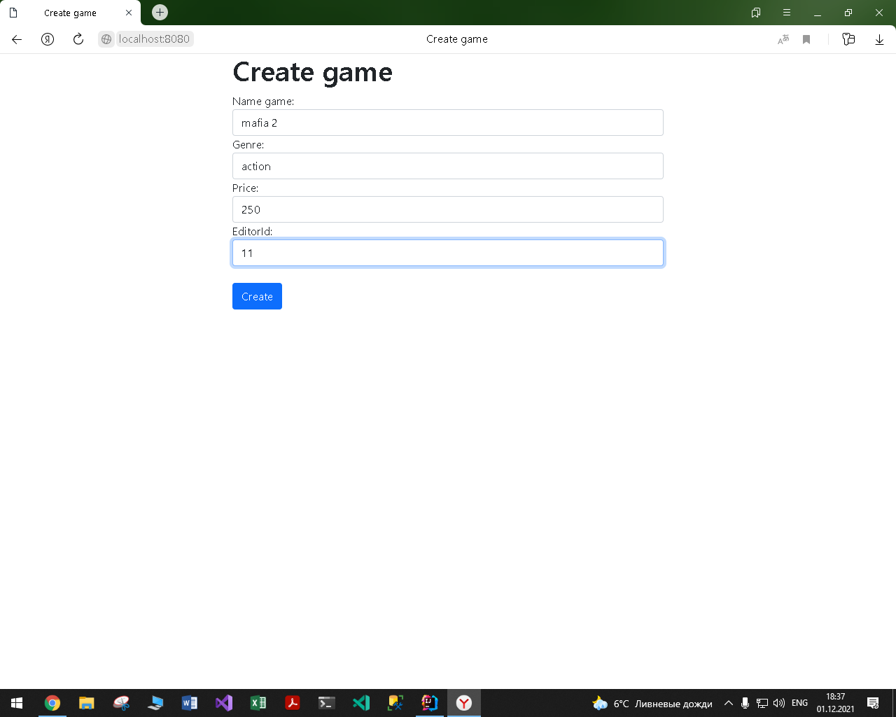
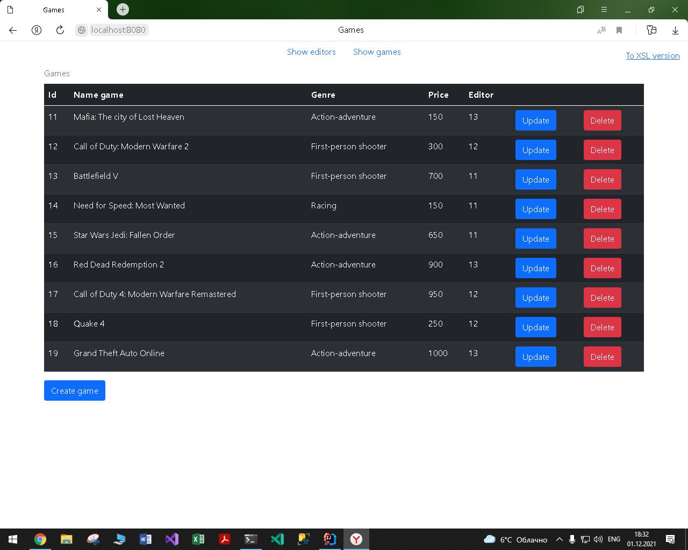
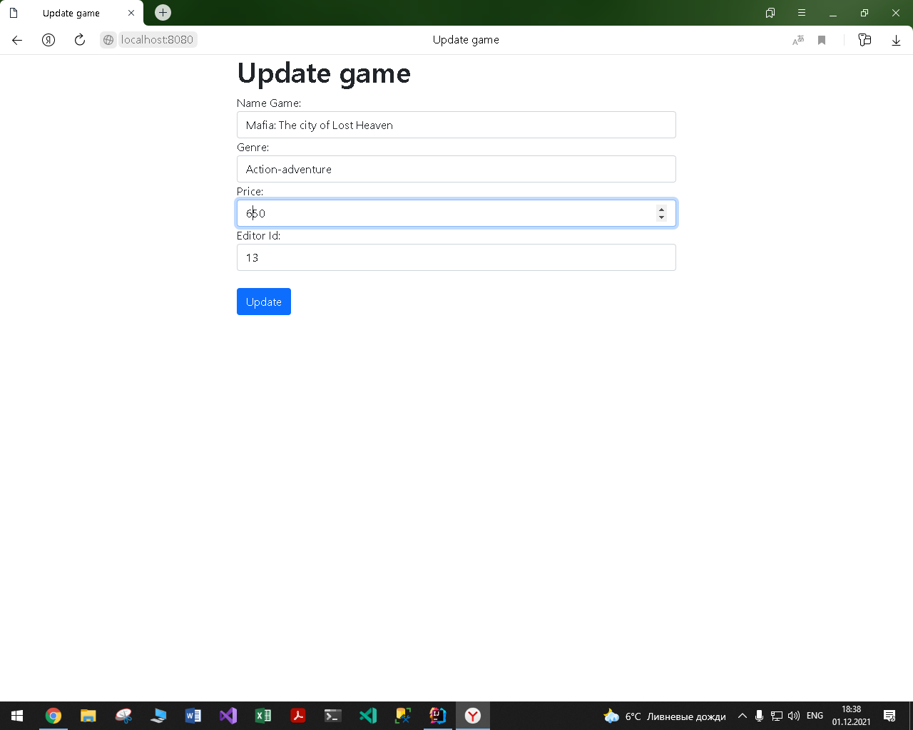
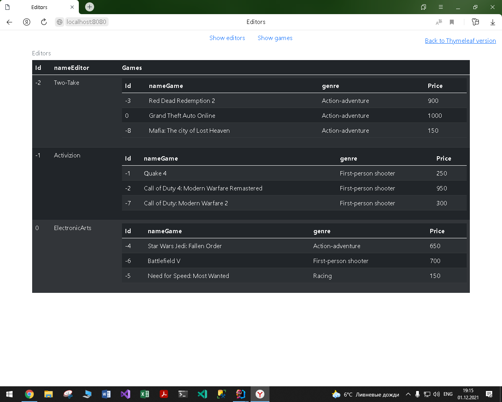
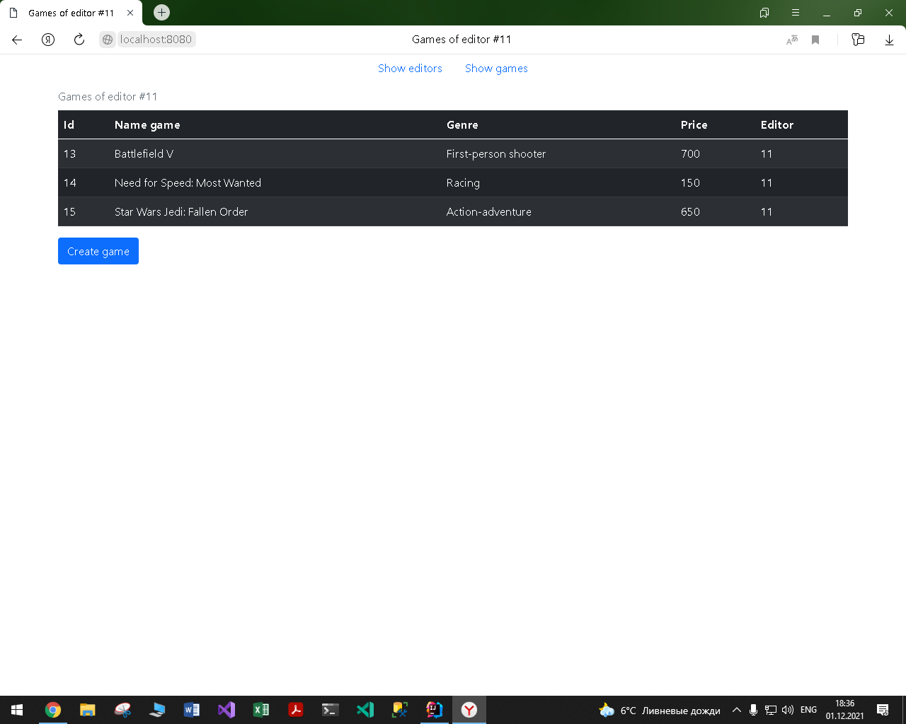

# Лабораторная работа №3 по курсу "Архитектура Корпоративных Систем": "RESTful web-service" 
# Отличия от предыдущей лабораторной работы.
Данная лабораторная работа написана на основе предыдущей: <a href="https://github.com/Black-Viking-63/ESA_LabWork/tree/main/labwork2final">labwork2final.</a> 
А соответственно имеет несколько отличий.
* Внешне данная лабораторная работа отличается возможностью выбора представления данных.
* Внутреннее отличие заключено в добалении REST API для доступа к данным.
# Средства, используемые для разработки приложения
* JDK 16.0.2
* Spring Framework 5.3.9
* Tomcat 9.0.52
* PostgreSQL 13.3
* Intellij IDEA Ultimate 2021.2.1

# Задание на лабораторную работу
<table>
    <thead>
        <tr>
            <th colspan = 6> General Task</th>
        </tr>
        <tr>
            <th colspan = 6> You are to develop an application with REST web-service interface. Application should provide access to data within a database. It is strongly recommended to use version control and source code management system (like GitHub). It is strongly recommended to use Maven to manage your project. You can choose any IDE, but IntelliJ IDEA is recommended.
 </th>
        </tr>
        <th>Task 1</th>       
        <th>Task 2</th> 
        <th>Task 3</th>
        <th>Task 4</th>       
        <th>Task 5</th>
        <th>Task 6</th> 
    </thead>
    <tbody>
        <th>
        Compare JAX-RS and SpringREST. Choose one of them for your application. Give some arguments for your choice.
        </th>       
        <th>
        Choose one of your previous applications for further development. Develop a REST API for accessing your data.
        </th> 
        <th>
        Implement the API. It should allow usage of both XML and JSON.
        </th>
        <th>
        Develop an XSL transformation for your XML objects to make a browser able to show them as HTML pages (including object data and navigation to other entities and their lists).
        </th>       
        <th>
        Add the XSLT to all XML responses.
        </th>
        <th>
        Make everything work together…
        </th>    
    </tbody>
</table>

# Модель и бизнес логика
Spring Data JPA, Spring MVC 
В качетсве модели используется модель из предыдущей лабораторной работы: "Издатель - КомпьютернаяИгра", собствеено учатсники данной модели и являются сущностями. 
Схема базы данных "store", представлена на рисунке ниже. 
  
Для работы с базой данных использовались следующие скрипты: 
<a href="https://github.com/Black-Viking-63/ESA_LabWork/blob/main/labwork1final/sql_scripts/create_data.sql">create_data.sql - создание таблиц.</a> 
<a href="https://github.com/Black-Viking-63/ESA_LabWork/blob/main/labwork1final/sql_scripts/insert_data.sql">insert_data.sql - заполнение таблиц.</a> 
<a href="https://github.com/Black-Viking-63/ESA_LabWork/blob/main/labwork1final/sql_scripts/create_data.sql">delete_data.sql - удаление данных из таблицы.</a>  

# Представление данных
Thymeleaf и XSLT

# **Editor**
| create_editor | show_editors | update_editor |
| --- | --- | --- |
|  |  |  |

# **Game**
| create_game | show_games | update_game |
| --- | --- | --- |
|  |  |  |+

# **XSL**
| show_editors | show_games |
| --- | --- |
|  |  |
