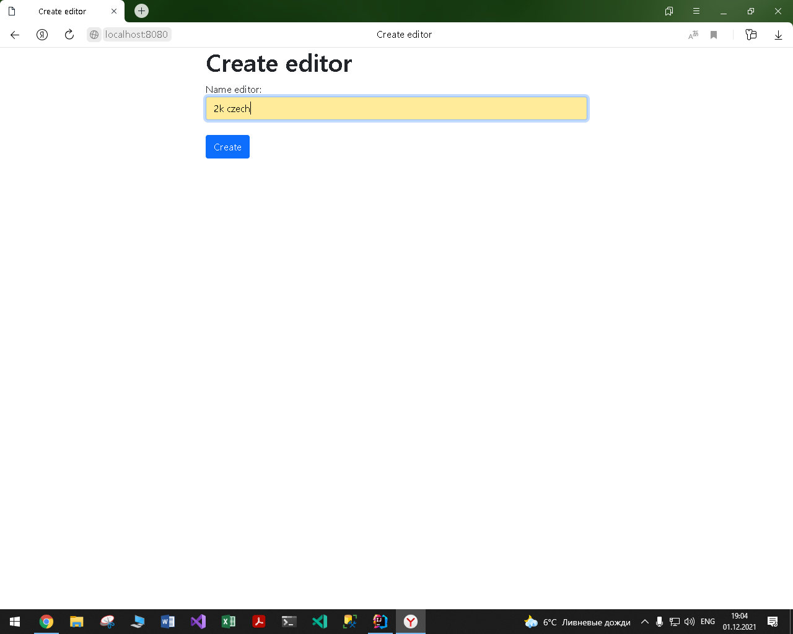
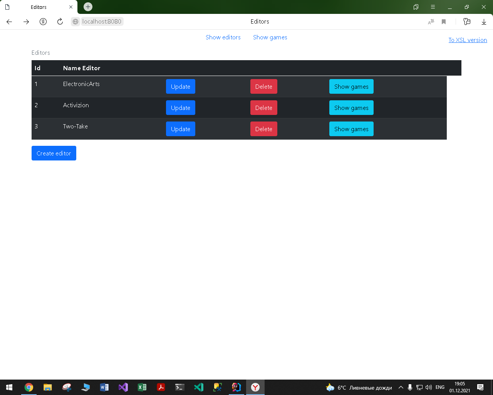
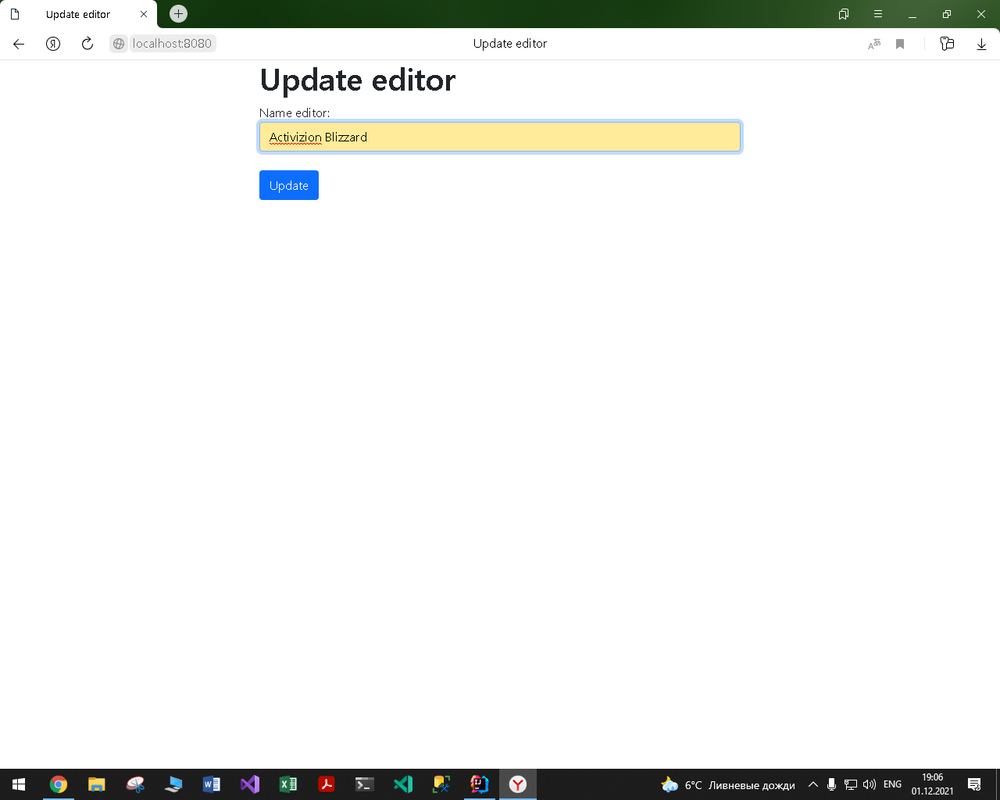
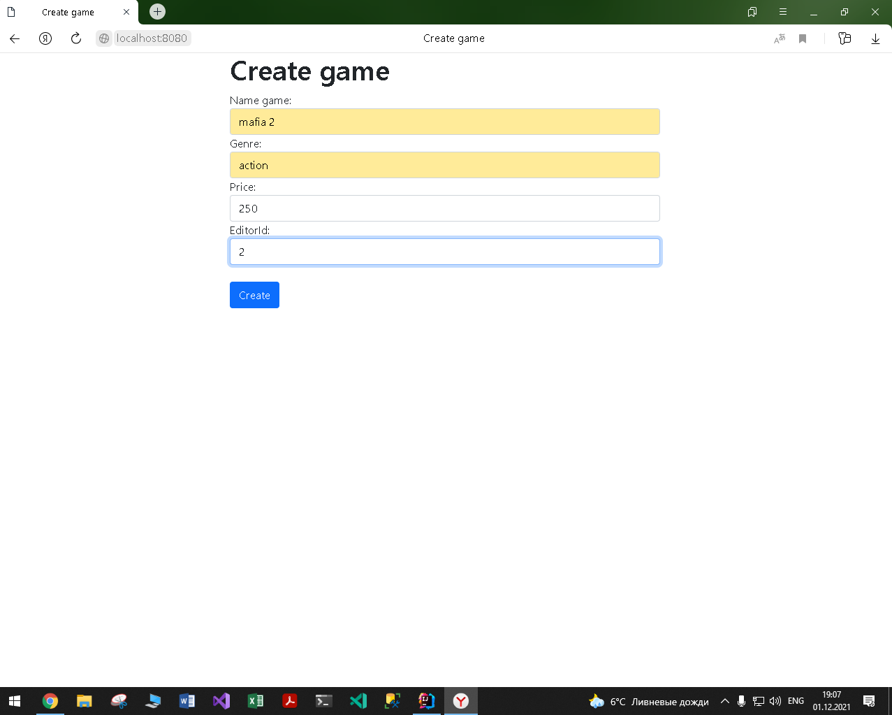
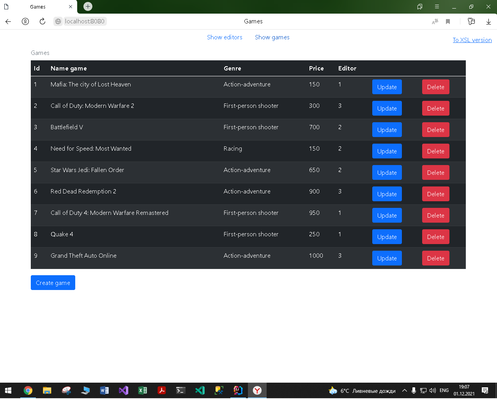
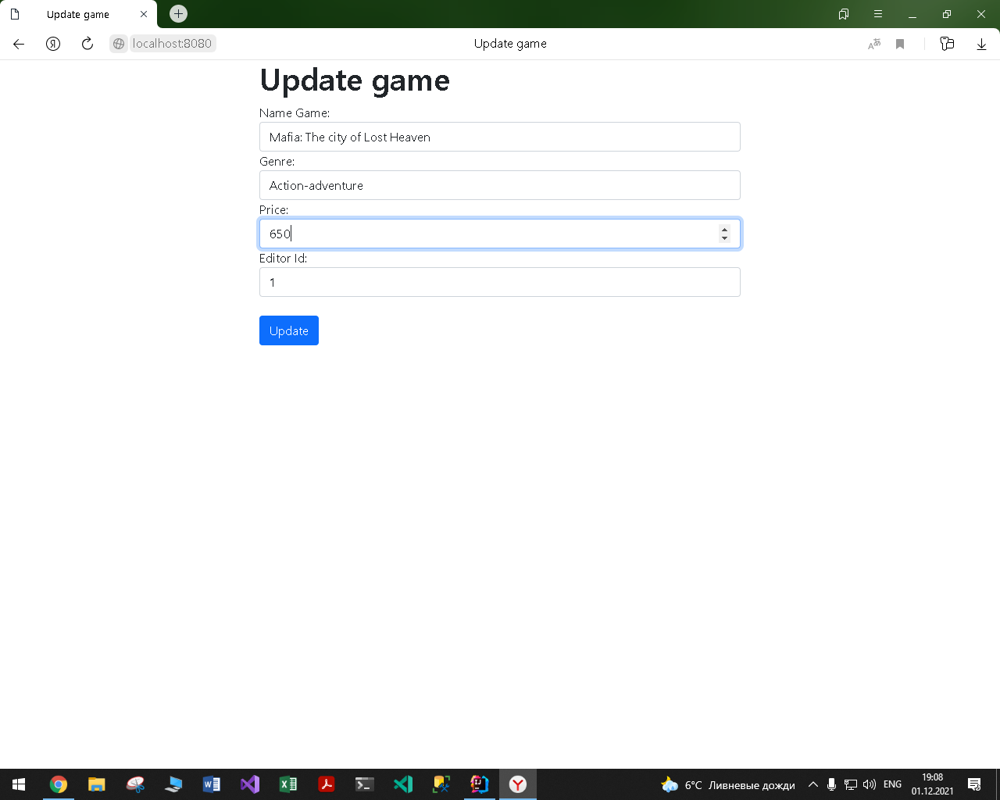
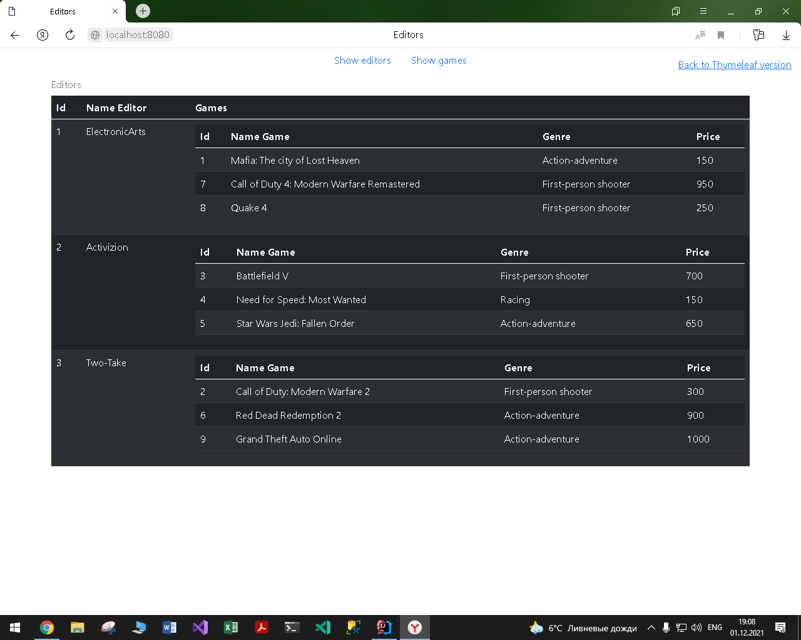
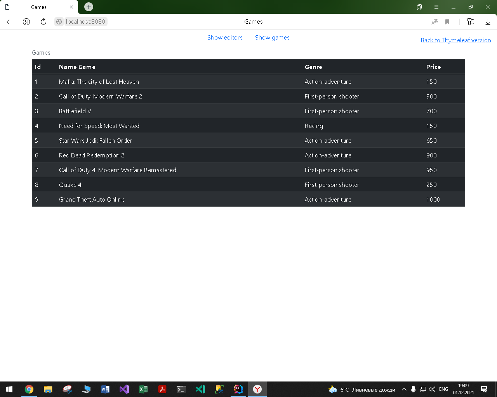

# Лабораторная работа №4 по курсу "Архитектура Корпоративных Систем": "Java Message Service" 
# Средства, используемые для разработки приложения
* JDK 16.0.2
* Spring Boot 2.6.1
* PostgreSQL 13.3
* Intellij IDEA Ultimate 2021.2.1

# Задание на лабораторную работу
<table>
    <thead>
        <tr>
            <th colspan = 7> General Task</th>
        </tr>
        <tr>
            <th colspan = 7> You are to add some new functionality to the previous application, namely a logging mechanism and a “watchdog” for a specific kind of changes. Logging should provide a simple mechanism to put information on changes in your system into a special table of the database. “Watchdog” should send e-mail notifications on specific changes in the system to some specified e-mail addresses. It is strongly recommended to use version control and source code management system (like GitHub). It is strongly recommended to use Maven to manage your project. You can choose any IDE, but IntelliJ IDEA is recommended.
 </th>
        </tr>
        <th>Task 1</th>       
        <th>Task 2</th> 
        <th>Task 3</th>
        <th>Task 4</th>       
        <th>Task 5</th>
        <th>Task 6</th>       
        <th>Task 7</th>
    </thead>
    <tbody>
        <th> Add new table to your database. Each row should represent a change of information in other tables of your database. A row should contain information on a kind of a change (insert, update, etc.), on a changing entity (e.g. its class, id) and on a substance of a change (e.g. new values for fields).
</th>       
        <th> Create and configure JMS administrative objects in your application server. Choose type of destination object wisely.
</th> 
        <th> Change your application to make it send a message to the destination object every time some changes are applied to entities. Choose message type and structure reasonably.
</th>
        <th> Develop MDB or MDP (depending on your technology platform) to receive these messages. Then MDB or MDP should check message’s type and structure, and then make a record into the dedicated table.
</th>       
        <th> Choose a type of events you want to make notifications for. It can be changes of exact entity, changes of entities with names containing some specific string, some entity attribute exceeding some boundaries, etc. Specify additional information required to identify such an event (e.g. entity id, specific string, attribute boundaries, etc.). Add new table to the database. Each row should contain an e-mail for notification and condition information. 
</th>
        <th> Develop MDB or MDP to receive messages on changes, check conditions and send e-mails. Some additional class may be required.
</th>       
        <th>Make everything work together…
</th>
    </tbody>
</table>

# Задание 1.
Для выполнения данного задания была добавлена новая таблица: DbChange - которая представляет собой изменение информации в других таблицах базы данных. 

# Задание 2.
Для выполнения данного задания были созданы два класса, которые обеспечивают обработки логики JMS: отправитель и получатель. Отправитель необходим для создания объекта DbChange и отправки его получателю. Receiver осуществляет проверку объекта DbChange, после чего сохраняет его в БД и отправляет уведомления по электронной почте.

# Задание 3
Для выполнения данного заданя была добавлена реализация Sender bean в сервисы для отправки сообщений при каждом изменении базы данных.

# Задание 4
В данном задание получатель получает эти сообщения, а после чегоделает запись в таблицу "db_change".

# Задание 5
Для выполнения данного задания была добавлена новая таблица (сущность): Notification, содержащая адрес электронной почты для уведомления и состояния.

# Задание 6
В данном задании получатель использует EmailManagerService для отправки электронных писем.

# Задание 7
Проект работает с Spring Boot и PostgreSQL.

# Представление данных
Thymeleaf и XSLT

# **Editor**
| create_editor | show_editors | update_editor |
| --- | --- | --- |
|  |  |  |

# **Game**
| create_game | show_games | update_game |
| --- | --- | --- |
|  |  |  |

# **XSL**
| show_editors | show_games |
| --- | --- |
|  |  |
